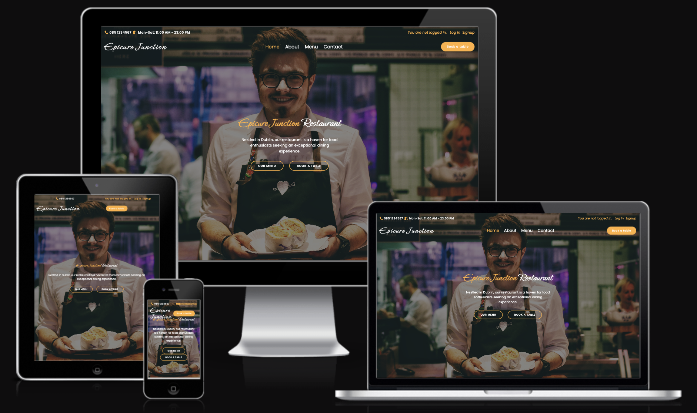
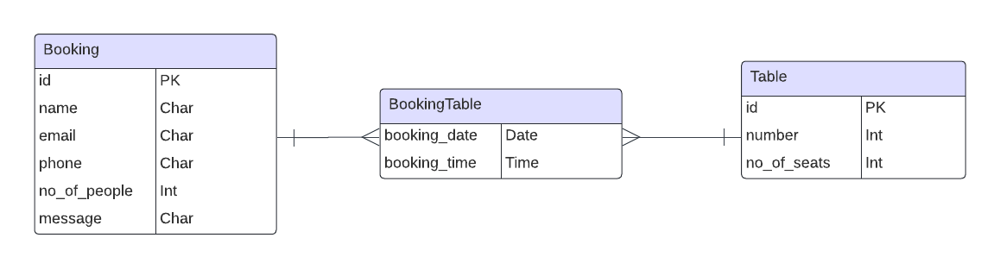
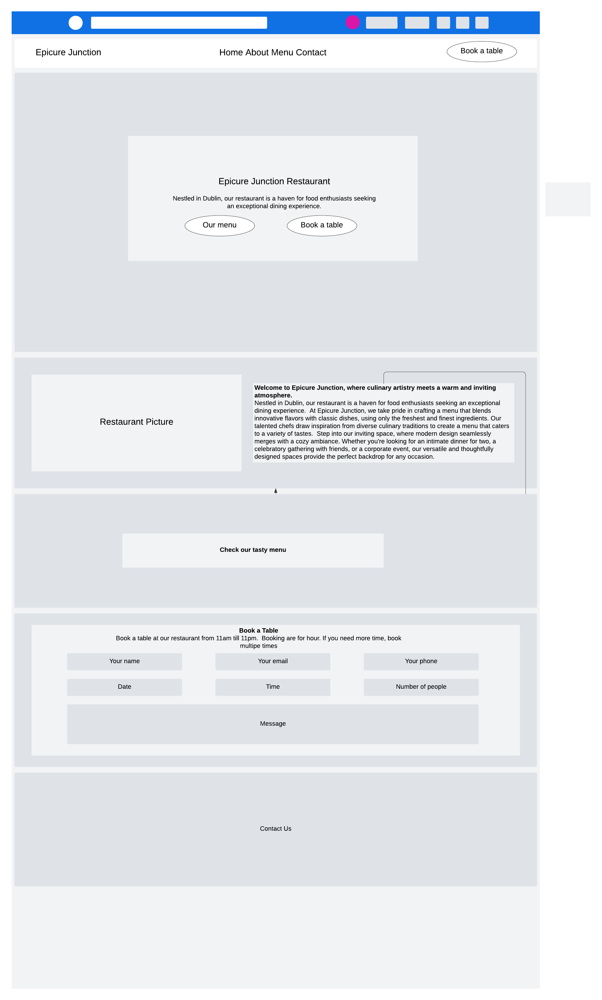
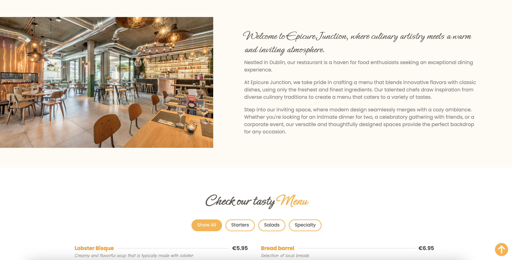
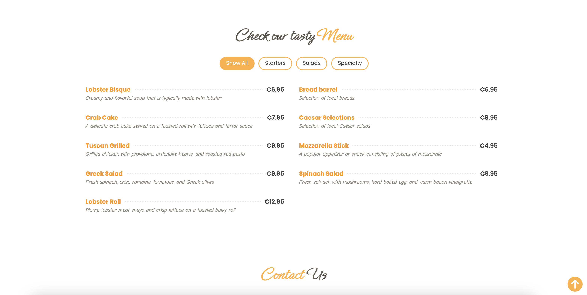
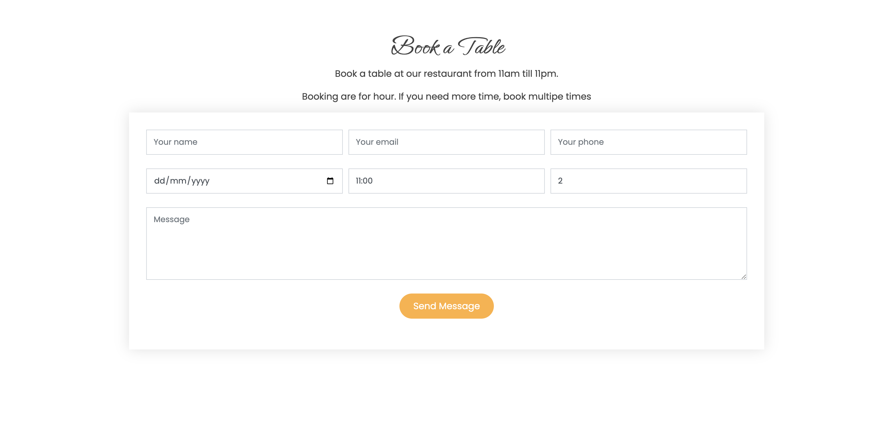
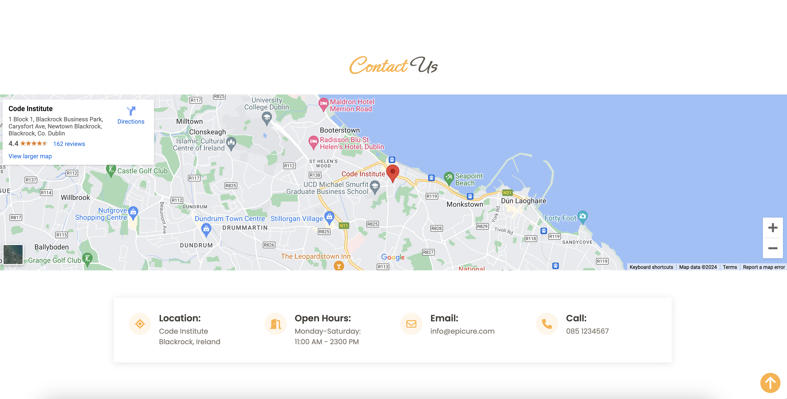
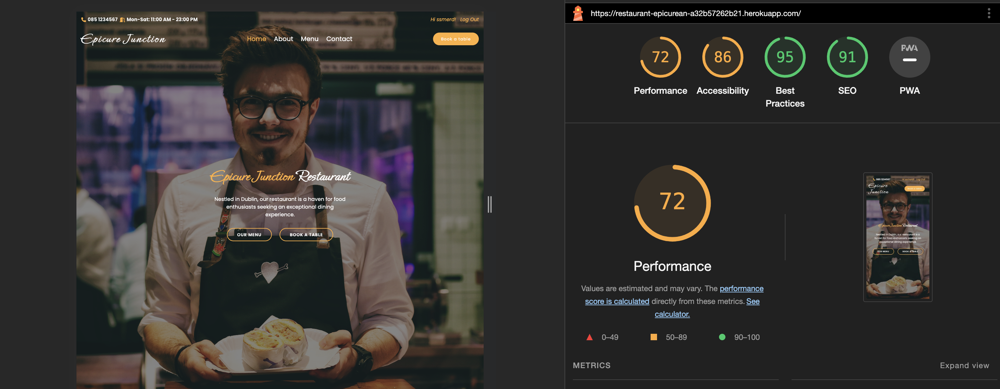

# Epicure Junction

## A restaurant website.
> A themed restaurant website showcasing the venue, menu, events. The site allows to book one or more guests for a meal in a restaurant and a particular time and date. The site should alo avoid double bookings and allows multiple table occupancies. In order to book a table or tables, a user needs to sign up and/or login. 

### - By Sebastian Smerd

## **[Live site](https://restaurant-epicurean-a32b57262b21.herokuapp.com/)**

## **[Repository](https://github.com/ssmerd/epicurean)**

  
## Table of contents

<a name="contents">Back to Top</a>
 1. [ UX ](#ux)
 2. [Agile Development](#agile)
 3. [ Features ](#features)  
 4. [ Features Left to Implement ](#left)  
 5. [ Technology used ](#tech) 
 6. [ Testing ](#testing)  
 7. [ Bugs ](#bugs)  
 8. [ Deployment](#deployment)
 9. [ Credits](#credits)
 10. [ Content](#content)  
 11. [ Acknowledgements](#acknowledgements)  
 

## UX

#### Pre-project Planning

> Database Structure

The ERD diagram shows the logical structure of the database used in the project. I converted it to the ORM model used in Django. This, next, was converted by Django to physical structure in the Postgress database. It is important that the restaurant table must be configured before the application is used. It has to contain a row for every individual table, with its number and number of seats.

### Database Schema

#### Booking

| id | Field |
|--|--|
| name | Charfield |
| email | Charfield |
| phone| CharField|
| no_of_people | IntegerField |
| message | CharField | 

---

#### Table

| id | Field |
|--|--|
| number | IntegerField |
| no_of_seats | IntegerField|

---

#### BookingTable

| id | Field |
|--|--|
| booking_date | DateField|
| booking_time | TimeField|

# UX design

## Overview

Epicure Junction is a Fictional restaurant. The main goal of the website is to allow users to view some photos of the venue, see what they have to offer, view the menu and if it is to their liking then the user can create an account and use it to make reservation requests.

### Design

I decided that I wanted this website to be modern, minimalistic in it's appearance. 

### Site User

 - Someone within the same city as the restaurant looking for new places to visit
 - Someone who would prefer to make bookings digitally rather than speaking with others

###  Goals for the website

 - To allow customers to see their menus ahead of time
 - To allow customers to make bookings through the website 
 

## Wireframes

###  Wireframes

> Main page

My goal for this project was to create a simple sleek website that allowed the restaurant to showcase it's venue & menu. I intentionally ensure the number of pages was at a minimum to ensure the core functionality was the focus.

## Agile Development

### Agile Overview

This project was started alongside a GitHub Projects Page to track and manage the expected workload ahead.
The aim was to set out my expected workload, list the epics and then break them down into user stories or bite sized tasks to work towards and ultimately finish the site in good time.

To see Kanban please click [here](https://github.com/users/ssmerd/projects/2).

#### User stories

#####  Completed User Stories

To view any of the expanded details of the user stories please click on a user story below to be taken to the Kanban project.

If the specific user story does not auto pop up then please click on it from the project page and you will see the details and comments.

 1. [USER STORY: Create a restaurant website](https://github.com/ssmerd/epicurean/issues/1)
 2. [USER STORY: A customer signs up and/or logs in to the website](https://github.com/ssmerd/epicurean/issues/2)
 3. [USER STORY: Book a table](https://github.com/ssmerd/epicurean/issues/3)

The following User stories were not completed as they were deemed to be not necessary for this project at this time but are indications of possible future features:

 ##### Extra User stories
 
 1. [USER STORY: View my reservations]
 2. [USER STORY: Cancel my reservations]
 3. [USER STORY: Owner can view current reservations]
 4. [USER STORY: Owner can cancel current reservations]

[Back to Top of page](#contents)

---

## Features

#### User based Features Implemented:

 - **Users can** navigate the restaurant website
 - **Users can** create an account
 - **Users can** log into their account
 - **Users can** log out of their account
 - **Users can** make a booking through the reservation form 

#### Account restrictions:

 - **Users cannot** access the reservation form until they sign up or login
 - **Users cannot** access the admin panel of the website unless they have admin status

#### Website features:

### Main website

#### Desktop

> Desktop Navigation

 - The desktop navigation consists of a Home, About, Menu and Contact. 
 - A user can sign up, log in or book a table from this website.
 - If a user isn't logged in, and presses book a table, the login page will pop up

---

> About page

---

> Menu page

---

> Book a table pabe

- The form can be used to book a table or tables by a user
- A user can book multiple tables if the number of user don't fit in one table
- A user can only book a table from 11am till 11pm
- One booking is for one hour
- A user can send an optional message

---

> Contact

  

[Back to Top of page](#contents)

---

## Features left to Implement 

 - Add ability for customers to view and cancel their bookings
 - Add ability for a restaurant owner to see all the bookings
 - Add ability for a restaurant owner to cancel bookings
 - Send an email to a customer with their reservations

[Back to Top of page](#contents)

---

##  Technology Used

- Html

- CSS

- JavaScript

- Python

- Django

- Font Awesome

- Bootstrap 5

- Jinja 

- GitHub

- Heroku

- Elephant PostgreSQL

- Cloudinary

- Git

- JQuery Timepicker

- Google Fonts

- Isotope JS library

[Back to Top of page](#contents)

---

## Testing

### Testing Phase

#### Account Registration Tests
| Test |Result  |
|--|--|
| User can sign up | Pass |
| User can log into account| Pass|
|User can log out of account|Pass|

---

#### User Navigation Tests

| Test |Result  |
|--|--|
|User can navigate to Reservations | Pass |
|User can access menu items| Pass|

---

#### Account Security Tests

| Test |Result  |
|--|--|
|Non logged in user cannot make reservation | Pass |

---

#### Booking Tests

| Test |Result  |
|--|--|
|User can make a booking when all fields complete | Pass |
|User tries to submit booking with empty fields |Fail|
|User tries to submit over book |Fail|

---

## Google Lighthouse Testing

### Desktop

- When the database is deployed on Elephant SQL performance is poor
- When the database is local the performance is very good.

## HTML W3 Validation

### index.html

#### Result: No Errors

### CSS Validation

#### Result: Pass - No Errors

[Back to Top of page](#contents)

---

## **Bugs**

#### Django templating bug

- When I ran my code through the w3 html validator I got over 40 errors that I did not expect.
- Upon review I could see Django was submitting fresh 
 Tags around my templated content for menu descriptions.
- I removed the existing 
 Tags from my HTML code and this issue was cleared.
  
#### Bookings not displaying
  
- When implementing the booking system to user profiles I linked the templates temporarily to the user-email.
- When a user tried to book under another email address that did not match the one on their account the bookings basically dissapeared.
- To fix this issue and also because I want users to be able to update their email I extended the user model with a customer model and linked each booking to userid.
- This way the customer will always have their own bookings.

#### Image not loading once deployed

- Once I deployed the project to heroku and finished development, only one of the images in cloudinary did not load.
- I was being presented with a 404 even though the file was in cloudinary and the file path was correct.
- As a work around Scott (tutor from CI) advised to copy the direct URL to the image rather than relying on the Cloudinary api to render the image.
- Once I reloaded the static and pushed to github, my heroku app reloaded and was deployed and working.

[Back to Top of page](#contents)

---

## Deployment

> I have broken up the deployment into two sections as it is quite extensive and can be hard to follow.

To deploy the project through Heroku I followed these steps:

- Sign up / Log in to  [Heroku](https://www.heroku.com/)
- From the main Heroku Dashboard page select 'New' and then 'Create New App'
- Give the project a name - I decided on the devils kitchen and selected EU as that is the closes region to me.
- After this you select select create app. 
- The name for the app must be unique or you will not be able to continue.
- Heroku will create the app and bring you to the deploy tab. 
- From the submenu at the top, navigate to the resources tab.
- Add the database to the app, in the add-ons section search for 'Heroku Postgres', select the package that appears and add 'Heroku Postgres' as the database
- Click on the setting tab
- Open the config vars section copy the DATABASE_URL to the clipboard for use in the Django configuration.
- Inside the Django app repository create a new file called env.py
- within this file import the os library and set the environment variable for the DATABASE_URL pasting in the address copied from Heroku. 
- The line should appear as os.environ["DATABASE_URL"]= "Paste the link in here"
-   Add a secret key to the app using os.environ["SECRET_KEY"] = "your secret key goes here"
-   Add the secret key just created to the Heroku Config Vars as SECRET_KEY for the KEY value and the secret key value you created as the VALUE
-   In the settings.py file within the django app, import Path from pathlib, import os and import dj_database_url
-   insert the line if os.path.isfile("env.py"): import env
-   remove the insecure secret key that django has in the settings file by default and replace it with SECRET_KEY = os.environ.get('SECRET_KEY')
-   replace the databases section with DATABASES = { 'default': dj_database_url.parse(os.environ.get("DATABASE_URL"))} ensure the correct indentation for python is used.
-   In the terminal migrate the models over to the new database connection
---
-   Navigate in a browser to cloudinary, log in, or create an account and log in.
-   From the dashboard - copy the CLOUDINARY_URL to the clipboard
-   In the env.py file - add os.environ["CLOUDINARY_URL"] = "paste in the Url copied to the clipboard here"
-   In Heroku, add the CLOUDINARY_URL and value copied to the clipboard to the config vars
-   Also add the KEY - DISABLE_COLLECTSTATIC with the Value - 1 to the config vars
-   this key value pair must be removed prior to final deployment
-   Add the cloudinary libraries to the list of installed apps, the order they are inserted is important, 'cloudinary_storage' goes above 'django.contrib.staitcfiles' and 'cloudinary' goes below it.
-   in the Settings.py file - add the STATIC files settings - the url, storage path, directory path, root path, media url and default file storage path.
-   Link the file to the templates directory in Heroku TEMPLATES_DIR = os.path.join(BASE_DIR, 'templates')
-   Change the templates directory to TEMPLATES_DIR - 'DIRS': [TEMPLATES_DIR]
-   Add Heroku to the ALLOWED_HOSTS list the format will be the app name given in Heroku when creating the app followed by .herokuapp.com
-   In your code editor, create three new top level folders, media, static, templates
-   Create a new file on the top level directory - Procfile
-   Within the Procfile add the code - web: guincorn PROJECT_NAME.wsgi
-   In the terminal, add the changed files, commit and push to GitHub
-   In Heroku, navigate to the deployment tab and deploy the branch manually - watch the build logs for any errors.
-   Heroku will now build the app for you. Once it has completed the build process you will see a 'Your App Was Successfully Deployed' message and a link to the app to visit the live site.

#### Forking the repository

By forking the GitHub Repository you can make a copy of the original repository to view or change without it effecting the original repository.
You can do this by: 
-  Logging into GitHub or create an account. 
- Locate the repository at  [here](https://github.com/Alan-Bushell/la-cocina-del-diablo)  . 
-  At the top of the repository, on the right side of the page, select "Fork" from the buttons available. 
-  A copy of the repository should now be created in your own repository.

#### Create a clone of this repository

Creating a clone enables you to make a copy of the repository at that point in time - this lets you run a copy of the project locally: This can be done by:

-   Navigate to  [https://github.com/Alan-Bushell/la-cocina-del-diablo](https://github.com/Alan-Bushell/la-cocina-del-diablo)
-   click on the arrow on the green code button at the top of the list of files
-   select the clone by https option and copy the URL it provides to the clipboard
-   navigate to your code editor of choice and within the terminal change the directory to the location you want to clone the repository to.
-   type 'git clone' and paste the https link you copied from github
-   press enter and git will clone the repository to your local machine

[Back to Top of page](#contents)

---
  

## Credits
  
##### Dennis ivy
  - I watched some of Dennis's videos on youtube around django signals and extending the user model.
  - This inspired me to take this action however I followed on from the django documentation
  
  
##### Md bootstrap
  - I went through the bootstrap navigation information and footer information to determine how best to approach my desired design.
  - I always find Md Bootstrap helpful with examples of how best to implement boostrap components.
  
  
##### Pexels
  - I samples some images from pexels to help fill out the color of this project.
  Here is a list of images used:
  
  Pexels images:

- Wine pic: https://www.pexels.com/photo/clear-footed-glass-beside-bowl-370984/

- table food pic: https://www.pexels.com/photo/photo-of-sliced-cheese-on-wooden-surface-4087609/

- dark kitchen pic: https://www.pexels.com/search/restaurant%20flames/?orientation=landscape

- bar  https://www.pexels.com/photo/person-sitting-near-bottles-1554654/

- venue - https://www.pexels.com/photo/group-of-people-in-a-concert-during-night-time-5152546/

- event image - https://www.pexels.com/photo/music-band-performs-on-stage-during-nighttime-736355/
  
  > All images sourced from Pexels and any credit is owed to the owners of the photos who have very kindly shared them for free usage.
  

[Back to Top of page](#contents)

---

## Content & Resources
  
##### Django Documentation
  - Read through the django documentation multiple times when trying to implement models and other content.
  
##### W3 Schools
  - Used for reference throughout for simple css examples.
  
##### Code Institute
  - Course content for portfolio project 4 helped greatly in being able to complete this project.
  - I found the walkthroughs informative and well paced.
  - Initial structure based heavily on the CI walkthrough until I got more comfortable with the framework and started to make it my own.
  - Some legacy code regarding nav remains.

[Back to Top of page](#contents)

---

## Acknowledgements

### Dick Vlandeeren
> My mentor who provided me with constructive feedback  and guidance throughout.
  
### The tutors at Code institute
> To all the tutors in CI, thank you for your patience. Special shout outs to Ger, John, Sean, Oisin & Scott.